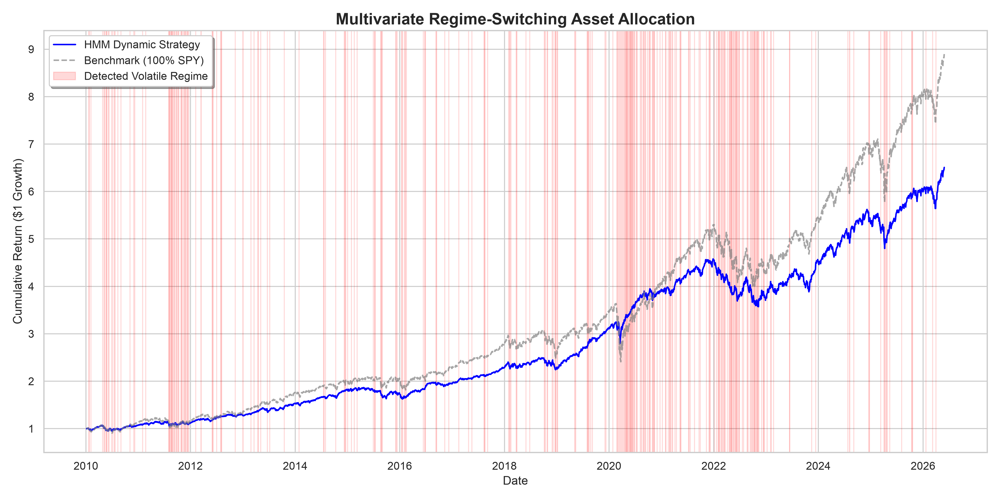

# Multivariate Regime-Switching Asset Allocation

## Overview
This repository contains a quantitative asset allocation strategy that dynamically shifts portfolio weights between Equities (SPY), Bonds (TLT), and Gold (GLD) based on unsupervised machine learning regime detection.

## The Financial Intuition
Static portfolios often suffer catastrophic drawdowns during high-volatility macro regimes. This pipeline utilizes a **Multivariate Hidden Markov Model (HMM)** to identify the current "hidden" market state (e.g., Calm Bull Market vs. Volatile Bear Market) without relying on lagging government economic data.

The model clusters market regimes by observing real-time, forward-looking symptoms:
* **SPY Daily Returns** (Immediate price momentum)
* **^VIX** (Implied Volatility and institutional hedging)
* **^TNX** (10-Year Treasury Yield expectations)

## Methodology
1. **Data Acquisition:** `yfinance` API for daily closing prices.
2. **Machine Learning:** Gaussian HMM (`hmmlearn`) with a full covariance matrix to classify multi-dimensional daily data into discrete market regimes.
3. **Dynamic Allocation Logic:**
   * *Regime 0 (Calm/Growth):* 80% SPY / 20% TLT
   * *Regime 1 (Volatile/Risk-Off):* 30% SPY / 50% TLT / 20% GLD

## Results

### Performance Metrics (2010 - 2026)
* **HMM Strategy:** Sharpe Ratio: 1.11 | Max Drawdown: -22.00%
* **Benchmark (100% SPY):** Sharpe Ratio: 0.87 | Max Drawdown: -33.72%

*Notice how the model successfully identifies the high-volatility regimes (shaded red), specifically during the 2020 crash and 2022 rate-hike environment. By dynamically shifting defensive (30% SPY / 50% TLT / 20% GLD) during these periods, the algorithm avoided nearly 12% of the benchmark's maximum drawdown while simultaneously improving the overall risk-adjusted return (Sharpe).*
